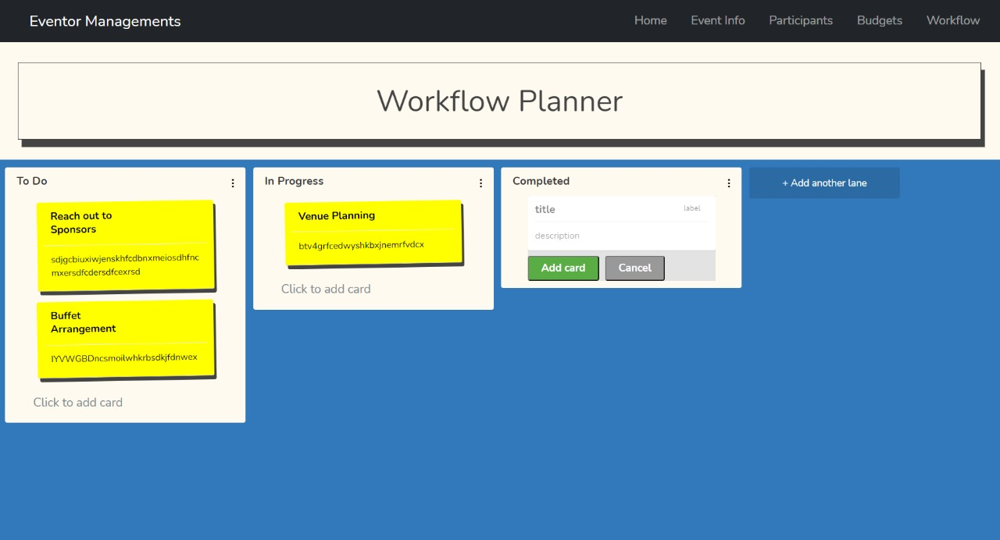

# Eventor Managements :sparkles:

> This web application has been created by Team Accuracy Sneakers ([McTechie](https://github.com/McTechie) and [SauravTelge](https://github.com/SauravTelge)) for the [**Frost Hack 2021**](https://frosthack.com/) targetting the '**Event Management**' theme

### Tech Stack Used

- [x] HTML5
- [x] CSS3
- [x] Bootstrap (UI)
- [x] Next.js (Frontend)
- [x] Vercel (Deployment &amp; Hosting)
- [x] Firebase (Backend / Database)

---

### Sitemap

- **Home (Landing Page) -** Serves as the landing page for the web application
- **Event Info -** Provides details regarding the event to be conducted and provides a form for interested participants to register
- **Participants -** Lists all the registered participants for the event, with their details
- **Workflow -** A kanban-styled page to organize project workflows

---

### Landing Page

---

### Workflow Planner

---
